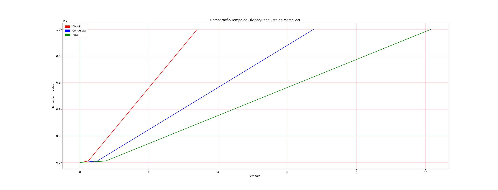

# DC_MergeRuntime

Temas:

- Dividir e Conquistar

# Merge Runtime

**Número da Lista**: 14<br>
**Conteúdo da Disciplina**: Merge sort <br>

## Alunos

| Matrícula  | Aluno                                           |
| ---------- | ----------------------------------------------- |
| 16/0119553 | 👨‍💻 Felipe Campos de Almeida                     |
| 16/0005736 | 👩‍💻 Fabiana Luiza Vasconcelos Pfeilsticker Ribas |

## Sobre ℹ️

Para visualizar melhor o tempo de execução do algoritmo de merge sort, plotamos um gráfico para visualizar o tempo que o algoritmo dedica para dividir e para conquistar a ordenação.

## 📷 Screenshots

Retorno da execução do projeto. Gráfico que representa o tempo em que o algoritmo passa dividindo e conquistando.



## ⚙️ Instalação

**Linguagem**: 🐍 Python<br>

### Para distribuição Linux 🐧 :

**Para a execução do projeto é necessário a instalação previa do docker e docker-compose.**

1. [Clone](https://help.github.com/en/articles/cloning-a-repository) o repositório do projeto. Para clonar vá ao terminal e digite:

```
$ git clone https://github.com/projeto-de-algoritmos/DC_MergeRuntime.git
```

2. Entre na pasta do projeto:

```
$ cd DC_MergeRuntime
```

3. Para compilar o projeto, entre a pasta /api e execute o comando do docker:

```
$
$
```

4. Depois de realizar todos esses passos, aproveite o projeto e divirta-se!

## Outros

Referências: []()
